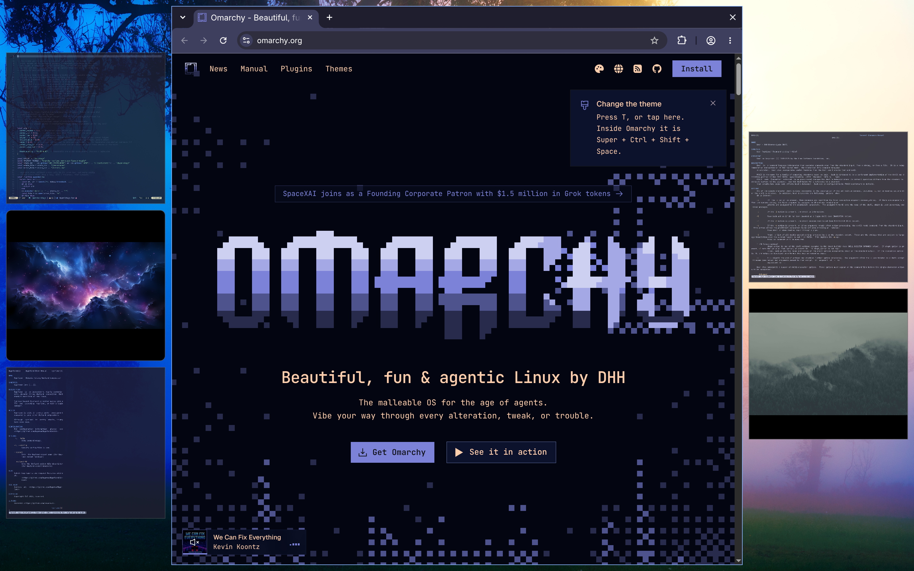
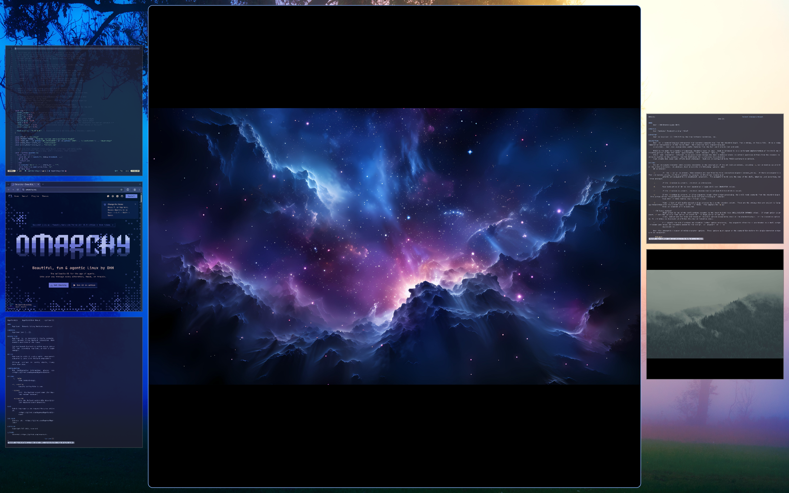
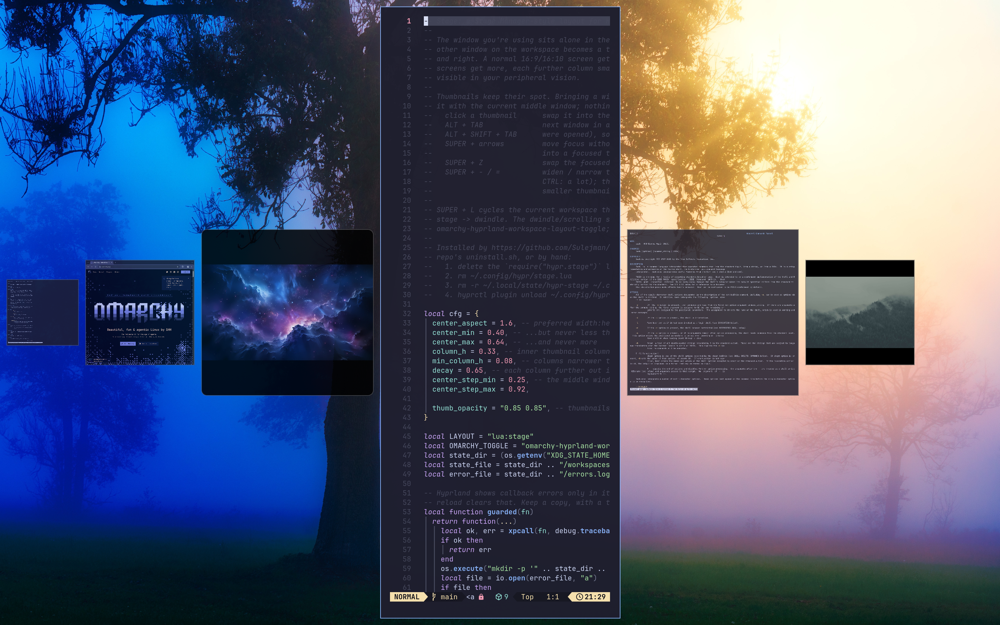

# Stage Layout for Omarchy

A Stage Manager-style tiling layout for [Omarchy](https://omarchy.org/) on Hyprland.

The window you're working in sits alone in the middle of the screen. Every
other window on the workspace becomes a thumbnail in columns on the left and
right. A normal 16:9 or 16:10 screen gets one column per side. Wider screens
get more columns, each one further out a bit smaller, so they stay visible in
your peripheral vision.

Thumbnails keep their spot. Bringing a window into the middle swaps it with
the current middle window, and nothing else moves.



| Any window can take the middle | Narrow the middle and more, smaller columns appear |
|---|---|
|  |  |

## Keys

Stage is added as a third step to Omarchy's layout toggle. Other workspaces
keep Omarchy's normal bindings.

| Key | Action |
|---|---|
| `SUPER + L` | Cycle the workspace layout: dwindle → scrolling → stage → dwindle |
| Click a thumbnail | Swap it into the middle |
| `ALT + TAB` / `ALT + SHIFT + TAB` | Next / previous window, in the order they were opened |
| `SUPER + arrows` | Move focus without moving anything (you can type into a thumbnail) |
| `SUPER + Z` | Swap the focused thumbnail into the middle |
| `SUPER + -` / `SUPER + =` | Widen / narrow the middle window (`ALT`: a little, `CTRL`: a lot). The freed space fills with more, smaller thumbnail columns |

Which workspaces are in stage mode and how wide their middle window is are
remembered across reloads and logins.

## Requirements

- Omarchy with Hyprland **0.56 or newer** (stage is a Hyprland Lua layout)
- Optional, for real miniatures: `base-devel` (`make`, `g++`). Hyprland's
  headers ship with the `hyprland` package. Without them, stage still works
  and thumbnails are plain small windows.

## Install

As an Omarchy plugin:

```bash
omarchy plugin add https://github.com/Sulejman/omarchy-stage --enable
```

Then press `SUPER + L` until the workspace switches to stage.

The plugin doesn't edit your Hyprland config. While it's enabled, it loads the
layout into the running Hyprland with `hyprctl eval`, and loads it again after
every config reload. On first start, and whenever the `hyprland` package
version changes, it builds the miniature-thumbnails plugin in its own folder
(a few seconds) and loads it with `hyprctl plugin load`.

Update with `omarchy plugin update io.github.sulejman.stage`.

### Manual install (alternative)

If you'd rather have stage in your Hyprland config than run it from the
shell, use the installer instead of the plugin, not both:

```bash
git clone https://github.com/Sulejman/omarchy-stage.git
cd omarchy-stage
./install.sh
```

It copies `stage.lua`, `stage-maintain.sh` and the `stagethumbs/` source into
`~/.config/hypr/` (any file it would change is backed up as `*.bak.<time>`),
adds `require("hypr.stage")` to `~/.config/hypr/hyprland.lua`, installs two
Omarchy hooks that rebuild the thumbnails plugin after updates, then builds it
and reloads Hyprland. Update with `git pull && ./install.sh`.

## Miniature thumbnails

Without the thumbnails plugin, a thumbnail is the real window resized to a
small box, so apps re-lay themselves out for that size. The optional
`stagethumbs` Hyprland plugin instead keeps telling the app it has its full
middle-of-screen size and draws that content scaled down. Clicks are scaled
too, so they land where they appear.

Hyprland plugins must be built against the exact Hyprland version that's
running, so both install methods rebuild it when the `hyprland` package
changes. If a build fails, you get a notification, stage keeps working with
plain thumbnails, and the log is in `stagethumbs/build.log` (inside the plugin
folder, or `~/.config/hypr/stagethumbs/` for a manual install).

## Tuning

The `cfg` table at the top of `hypr/stage.lua` holds the knobs: middle window
aspect and min/max share of the screen, thumbnail column width, how quickly
outer columns shrink, and thumbnail opacity. With the plugin, edit
`~/.config/omarchy/plugins/io.github.sulejman.stage/hypr/stage.lua` and run
`hyprctl reload`. With a manual install, edit `~/.config/hypr/stage.lua`
(Hyprland reloads on save). Updates replace the file, so keep a note of your
changes.

## Uninstall

Plugin:

```bash
omarchy plugin remove io.github.sulejman.stage
```

Disabling or removing it reloads Hyprland, so stage workspaces fall back to
the default layout right away. The thumbnails plugin stays loaded but idle
until you log out. Saved stage state is in `~/.local/state/hypr-stage`.
Delete that folder too if you won't reinstall.

Manual install: run `./uninstall.sh`. It removes the files, hooks, `require`
line and saved state, then reloads Hyprland.

## Troubleshooting

- Errors inside stage's callbacks are logged to
  `~/.local/state/hypr-stage/errors.log`, because Hyprland's red error bar is
  cleared on every reload.
- Check for key conflicts with your own bindings:
  `omarchy menu keybindings --print`.

## License

MIT
